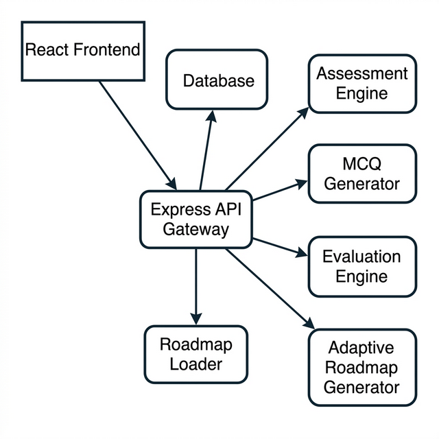

# Adaptive Learning Roadmap Generator

A full-stack intelligent platform that generates dynamic, personalized learning roadmaps based on a user's current knowledge and goals. Leveraging the power of Large Language Models (LLMs) via the Groq API, the system assesses your proficiency through adaptive MCQs and dynamically produces a customized path to mastery.



## Features

- **Personalized Learning Goals**: Define exactly what you want to achieve, from building production MERN applications to mastering advanced data structures.
- **Dynamic Assessments**: Take a real-time, LLM-generated quiz tailored to your goal. The assessment avoids brittle hardcoded questions, relying instead on multi-concept MCQs created on the fly.
- **Adaptive Evaluation**: The evaluation engine analyzes your answers, identifies weak topics, and determines any missing prerequisites.
- **Skill DNA Engine (Custom Algorithm)**: Beyond LLM output, a deterministic scoring engine computes weighted accuracy, module confidence, and a priority index using answer correctness + difficulty weighting + hard-question risk.
- **Bayesian Knowledge Tracing (ML, Local)**: A built-in learner model forecasts topic mastery, confidence, and immediate priorities from your historical attempts and recency decay. This runs entirely on your backend without third-party ML APIs.
- **Contextual Bandit Study Policy (New Trend)**: On top of BKT, a local Thompson Sampling policy chooses weekly study actions (explore vs exploit) and estimates time-to-readiness gains.
- **Deep Knowledge Tracing Service (DL, New)**: A GRU-based DKT model is now available via a production-ready FastAPI microservice. Backend endpoint `/api/progress/forecast-v2` compares baseline BKT vs DKT and gracefully falls back to baseline if the service is unavailable.
- **Uncertainty-Aware Active Assessment (DL-Guided)**: Assessment now runs in adaptive rounds. After each round, the backend uses DKT (with BKT fallback) to score topic uncertainty and expected information gain, then selects the next best topics and can stop early once confidence is sufficient.
- **Ablation and Evaluation Pipeline**: Offline scripts compute AUC, LogLoss, Brier score, and Top-K precision proxy for BKT vs DKT reporting.
- **Custom-Tailored Roadmaps**: Receive a comprehensive, ordered module-by-module roadmap, skipping concepts you already know and highlighting the exact topics you need to focus on.
- **Interactive UI**: A modern, responsive React + Vanilla CSS frontend offering a premium aesthetic with subtle micro-animations and clear progression tracking.
- **Progress Tracking**: Resume past roadmaps from your tailored roadmap history dashboard, complete with progress heatmaps and visual milestones.

## System Architecture

The project consists of a decoupled frontend and backend, orchestrated as follows:

1. **User Request**: The React frontend captures the user's ultimate learning goal.
2. **Intent Analysis (LLM)**: The Express backend parses the intent and establishes assessment boundaries.
3. **MCQ Generation (LLM)**: An initial batch of questions is generated covering base concepts.
4. **Evaluation (LLM)**: Upon submission, the engine pinpoints weak topics and necessary prerequisites.
5. **Skill DNA Analytics (Algorithmic Layer)**: A local engine ranks module priorities using weighted performance and confidence, producing an interview-friendly readiness score.
6. **Learning Forecast (ML Layer)**: Bayesian Knowledge Tracing predicts per-topic mastery probability and recommends what to focus on now.
7. **Policy Optimization (Bandit Layer)**: Contextual Thompson Sampling converts forecast outputs into an adaptive multi-day study schedule.
8. **Roadmap Synthesis (LLM)**: A finalized, customized CSV roadmap is synthesized, stripping away mastered topics.
9. **Data Persistence**: All attempts, performance data, and generated roadmaps are stored in MongoDB.

## Tech Stack

### Frontend
- **Framework**: React (Vite)
- **Styling**: Vanilla CSS, leveraging CSS Variables, Glassmorphism, and modern flex/grid layouts.
- **Routing**: React Router DOM (v6)

### Backend
- **Server**: Node.js & Express
- **Database**: MongoDB (Mongoose ORM)
- **AI Integration**: Groq API (Llama 3.3 70B & Llama 3.1 8B)
- **Validation**: Zod (Input validation)
- **Data Format**: CSV parsing and generation for easy roadmap portability.

## Deployment

- **Backend API**: [https://adaptive-minds.onrender.com](https://adaptive-minds.onrender.com)
- **Platform**: Render.com
- **Frontend Environment**: Configure `VITE_API_URL` to point to the backend deployment

To use the deployed backend, set the frontend environment variable:
```bash
VITE_API_URL=https://adaptive-minds.onrender.com
```

## Project Structure

```text
adaptive-roadmap/
├── frontend/                # React client application
│   ├── public/
│   └── src/
│       ├── components/      # Reusable UI components (Navbar, Sidebar, Heatmap)
│       ├── pages/           # Route views (Landing, Dashboard, Assessment, History)
│       ├── services/        # API integration layers
│       ├── state/           # Global Contexts (Auth)
│       └── styles/          # Core CSS variables and utilities
└── backend/                 # Express API server
    ├── data/
    │   └── roadmaps/        # Base CSV templates for default content
    └── src/
        ├── config/          # Environment & MongoDB configuration
        ├── controllers/     # Route handlers and business logic
        ├── models/          # Mongoose schemas (User, Attempt, GeneratedRoadmap)
        ├── prompts/         # Core LLM system prompts (engineered for Llama 3)
        ├── routes/          # API route definitions
        ├── services/        # Service logic (LLM integrations, roadmap parsing)
        └── utils/           # Helper functions and middlewares
```

## Getting Started

### Prerequisites
- Node.js (v18+)
- MongoDB instance (local or Atlas)
- Groq API Key
- Python 3.12 (recommended for `ml-service`)

### Installation

1. **Clone the repository** (if applicable) and navigate to the project directory:
   ```bash
   cd adaptive-roadmap
   ```

2. **Backend Setup**:
   ```bash
   cd backend
   npm install
   ```
   Create a `.env` file in the `backend/` directory based on `.env.example`:
   ```env
   PORT=5000
   MONGO_URI=your_mongodb_connection_string
   MONGO_DB=adaptive_roadmap
   JWT_SECRET=your_jwt_secret
   GROQ_API_KEY=your_groq_api_key
   FRONTEND_URL=http://localhost:5173
   ```

3. **Frontend Setup**:
   ```bash
   cd ../frontend
   npm install
   ```
   Create a `.env` file in the `frontend/` directory (if required) for API base configurations:
   ```env
   VITE_API_BASE_URL=http://localhost:5000
   ```

### Running the Application

To run the application locally, you will need two terminal windows:

Terminal 1 (Backend):
```bash
cd backend
npm run dev
```

Terminal 2 (Frontend):
```bash
cd frontend
npm run dev
```

The frontend will typically be available at `http://localhost:5173`, and the backend API will run on `http://localhost:5000`.

### Optional: Run Advanced ML Service (DKT)

The repository includes a deployable `ml-service/` package with training, evaluation, and serving code.

```bash
cd ml-service
python -m venv .venv
.venv\Scripts\activate
pip install -r requirements.txt

# Export sequence data from MongoDB
python -m src.training.export_from_mongo --mongo-uri "mongodb://localhost:27017" --db-name adaptive_roadmap --output artifacts/sequences.jsonl

# Train DKT and generate artifacts
python -m src.training.train_dkt --data artifacts/sequences.jsonl --artifacts artifacts

# Run ablation report (BKT vs DKT)
python -m src.training.evaluate_ablation --data artifacts/sequences.jsonl --artifacts artifacts --report reports/latest_ablation.md

# Start ML inference service
uvicorn src.app.main:app --host 0.0.0.0 --port 8001
```

Configure backend `.env` values:

```env
ML_FORECAST_URL=http://localhost:8001
ML_FORECAST_API_KEY=change_me
ML_FORECAST_TIMEOUT_MS=3500
```

When enabled, frontend forecast panels automatically consume `/api/progress/forecast-v2` and display advanced model outputs.

### Generate Reviewer Proof Bundle (With vs Without DL)

From `backend/`:

```bash
npm run proof:showcase
```

Output files:
- `ml-service/results/proof_showcase_report.md`
- `ml-service/results/proof_showcase_report.json`

## Architecture & Scalability Notes
- **Prompt Engineering**: This engine utilizes separated, highly tuned prompts for intent, generation, and synthesis, ensuring the LLM doesn't experience "context confusion."
- **Rate-Limiting**: The architecture is designed to manage Groq API limits by strictly batching MCQs and minimizing round-trip API calls per user action.
- **Stateless API**: The Express layer is largely stateless (outside of the database), allowing for horizontal scaling if needed.
